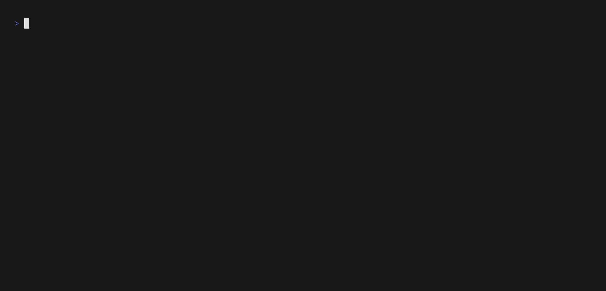

# kubectl-crdlist

[](https://goreportcard.com/report/github.com/xenos76/kubectl-crdlist)

<p align="center">
    </br>
    <b>Kubectl plugin to browse CRDs on Kubernetes</b>
</p>

## Demo

<details>

<p align="center">
    </br>
</p>

</details>

## Installation

<details>

### Go install

```shell
go install github.com/xenos76/kubectl-crdlist@latest
```

### Manual download

Release binaries and DEB, RPM, APK packages can be downloaded from the
[repo's releases section](https://github.com/xenOs76/kubectl-crdlist/releases).\
Binaries and packages are built for Linux and MacOS, `amd64` and `arm64`.

### APT

Configure the repo the following way:

```shell
echo "deb [trusted=yes] https://repo.os76.xyz/apt stable main" | sudo tee /etc/apt/sources.list.d/os76.list
```

then:

```shell
sudo apt-get update && sudo apt-get install -y kubectl-crdlist
```

### YUM

Configure the repo the following way:

```shell
echo '[os76]
name=OS76 Yum Repo
baseurl=https://repo.os76.xyz/yum/$basearch/
enabled=1
gpgcheck=0
repo_gpgcheck=0' | sudo tee /etc/yum.repos.d/os76.repo
```

then:

```shell
sudo yum install kubectl-crdlist
```

### Homebrew

Add Os76 Homebrew repository:

```shell
brew tap xenos76/tap
```

Install `kubectl-crdlist`:

```shell
brew install --casks kubectl-crdlist
```

Note: `kubectl-crdlist` is not configured and signed as a MacOS app. Manual
steps might be needed to enable the execution of the binary.

### Krew

```shell
❯ krew index add os76 https://github.com/xenOs76/krews.git
WARNING: To be able to run kubectl plugins, you need to add
the following to your ~/.bash_profile or ~/.bashrc:

    export PATH="${KREW_ROOT:-$HOME/.krew}/bin:$PATH"

and restart your shell.

WARNING: You have added a new index from "https://github.com/xenOs76/krews.git"
The plugins in this index are not audited for security by the Krew maintainers.
Install them at your own risk.

❯ krew index list
[...]
INDEX     URL
default   https://github.com/kubernetes-sigs/krew-index.git
os76      https://github.com/xenOs76/krews.git

❯ krew update
[...]
Updated the local copy of plugin index.
Updated the local copy of plugin index "os76".

❯ krew search crdlist
[...]
NAME              DESCRIPTION                                         INSTALLED
os76/crdlist      kubectl-crdlist, CRD visualization plugin for K...  no

❯ krew install os76/crdlist
[...]
Updated the local copy of plugin index.
Updated the local copy of plugin index "os76".
Installing plugin: crdlist
Installed plugin: crdlist
\
 | Use this plugin:
 |      kubectl crdlist
 | Documentation:
 |      https://github.com/xenOs76/kubectl-crdlist
/
```

</details>
